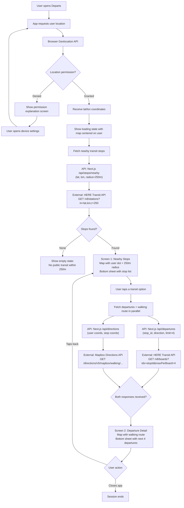

# Departs - User Journey & API Flow

## External API Calls Summary

| Step | API | Endpoint | Trigger |
|------|-----|----------|---------|
| Geolocation | Browser Geolocation API | `navigator.geolocation.getCurrentPosition()` | App launch |
| Nearby stops | HERE Public Transit API v8 | `GET /v8/stations?in={lat},{lon};r=250` | After geolocation succeeds |
| Departures | HERE Public Transit API v8 | `GET /v8/boards?ids={stationId}&maxPerBoard=4` | User taps a stop |
| Walking route | Mapbox Directions API | `GET /directions/v5/mapbox/walking/{coords}` | User taps a stop (parallel with departures) |
| Map tiles | Mapbox GL JS | Tile requests (automatic) | Whenever map is visible |

## Notes

- The departures and walking route requests fire **in parallel** when the user taps a stop, to minimize wait time.
- All external API calls are proxied through Next.js API routes — the browser never calls HERE or Mapbox Directions directly.
- Map tile requests (Mapbox GL JS) go directly from the browser to Mapbox CDN using the public token.
- If the walking route request fails, the app still shows departures (graceful degradation). The map falls back to showing both points without a route line.
